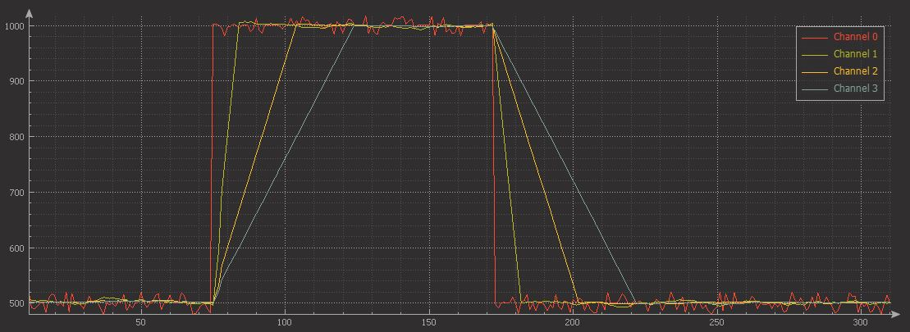
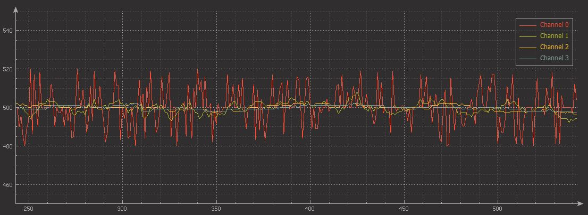

# Moving-average-filter
Average filter based on FIFO buffer

[Library files](https://github.com/binarymaker/Moving-average-filter/tree/master/sw-moving-average/User-Library/moving-average-library)
 
# Concept block 

```
                             input
                               +
                               |
                            +-----+ 
                            | S/H | <------------------ sampling time
                            +-----+ 
                               |
                               v
            +------------------+--------------------+
  index +-->+                 DEMUX                 |
            +----+------+------+----------------+---+
                 |      |      |                |
              +--+-+ +--+-+ +--+-+           +--+-+
              | B0 | | B1 | | B3 | . . . . . | Bn |   <- buffer
              +-+--+ +-+--+ +-+--+           +-+--+      n is size-1
                |      |      |                |
            +---+------+------+----------------+----+
            |              ACCUMULATOR              |
            +------------------+--------------------+
                               | <---------------------- sum
                               v
                      +--------+--------+
                      | divided by fill |
                      +--------+--------+
                               |
                               v
                            filtered
                             result
                             
```

# Code usage

```c
/* Include library */
#include "moving-average.h"

/* Filter objects */
movingAverage_t avg_filter;
movingAverage_t avg_filter_2;

void main()
{
   /* Initialization of filters */
   moving_average_create(&avg_filter, 10, 100);   /* filter size 10, sample time 100ms */
   moving_average_create(&avg_filter_2, 30, 150); /* filter size 30, sample time 150ms */

   /* wait for 1 maximum sample time */
   delay(150);

   while(1)
   {
      signal = signal_source();  /* signal source function may ADC, Capture count, sensor data*/

      /* Filter process
      * 
      * call this function maximum passible short time
      */
      moving_average_filter(&avg_filter, signal);
      moving_average_filter(&avg_filter_2, signal);

      process_or_print = avg_filter.filtered;
      process_or_print = avg_filter_2.filtered;
   }
}

```

# Filter images

   + channel 0 - signal + noise (+/- 20)
   + channel 1 - filter size 10, sample time 100ms 
   + channel 2 - filter size 30, sample time 100ms 
   + channel 3 - filter size 50, sample time 100ms 





Thank to [Graph - serial plot tool](https://github.com/CieNTi/serial_port_plotter) 


